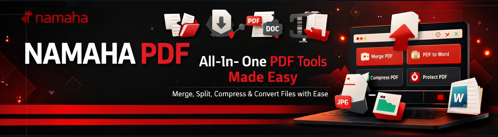

<p align="center">
  
</p>
<div align="center">
  
  
  
  
</div>

<br />

<div align="center">
  <h1>Avni PDF</h1>
  <p><strong>Professional PDF Management and Utility Suite</strong></p>
  <p align="center">
    <i>A high-performance, web-based toolset designed for efficient PDF manipulation, document conversion, and administrative workflows. Built with a focus on speed, precision, and privacy.</i>
  </p>
</div>

<hr />

## Project Overview

Avni PDF is engineered to bridge the gap between complex document processing and intuitive user interfaces. By leveraging modern web technologies, it provides server-side rendering for performance and client-side processing for data security. The application is tailored for professionals who require reliable document conversion and optimization without the overhead of heavy desktop software.

<hr />

## Core Functional Modules

### PDF Compression Engine
The compression module utilizes advanced algorithms to reduce the physical size of PDF documents while maintaining structural integrity and image clarity.
- **Precision Levels:** Choose from multiple optimization tiers (Low, Medium, High) to balance file size and quality.
- **Comparative Analysis:** Real-time metrics showing original vs. compressed file size and percentage reduction.
- **Batch Readiness:** Designed for future implementation of multi-file concurrent processing.

### Document Conversion (Word to PDF)
Powered by high-fidelity parsing libraries, this module ensures that Microsoft Word documents are accurately translated into the PDF standard.
- **Formatting Retention:** Precise mapping of fonts, tables, lists, and indentation.
- **Asset Integrity:** Embedded images and shapes are preserved at their native resolution.
- **Interactive Previews:** Inspect the document structure in a virtualized viewer before finalizing the conversion process.

### User Interface and Experience
- **Responsive Architecture:** Fully optimized for desktop, tablet, and mobile viewing environments.
- **System Synchronization:** Automatic switching between Light and Dark themes based on user preferences.
- **Optimized Motion:** Meaningful transitions that guide the user through the document lifecycle without distracting performance impacts.

<hr />

## Technical Architecture

The application follows a modular architecture to ensure scalability and ease of maintenance.

### Frontend Layer
- **Framework:** Next.js (React) for robust routing and component-based organization.
- **State Management:** React Hooks and Context API for managing document state and processing status.
- **Styling:** Tailwind CSS for a utility-first, performant design system.

### Processing Layer
- **PDF Manipulation:** pdf-lib for low-level document restructuring and metadata handling.
- **Conversion Logic:** mammoth.js for extracting semantic content from .docx structures into compliant HTML/PDF formats.

<hr />

## Getting Started

### Prerequisites
- Node.js (Version 14.0.0 or higher)
- npm (Version 6.0.0 or higher)

### System Setup

```bash
# Clone the project repository
git clone https://github.com/TusharThanvi1990/avni-pdf.git

# Enter the project directory
cd avni-pdf

# Install necessary project dependencies
npm install

# Launch the development environment
npm run dev
```

The application will be accessible at [http://localhost:3000](http://localhost:3000).

<hr />

## Roadmap and Future Enhancements

- **PDF Merging:** Combine multiple PDF documents into a single cohesive file.
- **Page Extraction:** Selective extraction of specific pages from larger PDF volumes.
- **Password Protection:** Encryption and decryption of sensitive PDF documents.
- **Cloud Integration:** Optional storage connectors for Google Drive and Dropbox.

<hr />

## Contribution Standards

We maintain high standards for code quality and documentation. To contribute:

1.  **Fork** the project repository.
2.  **Initialize** a descriptive feature branch: `git checkout -b feature/enhanced-processing`.
3.  **Implement** changes adhering to the existing coding standards.
4.  **Submit** a Pull Request with a comprehensive description of the modifications.

<hr />

## Legal and Support

### License
This project is licensed under the **Apache License 2.0**. For more details, please refer to the LICENSE file in the repository root.

### Contact Information
For technical inquiries, bug reports, or partnership discussions, please contact the lead developer:
**Tushar Thanvi** - [tushar.thanvi2005@gmail.com](mailto:tushar.thanvi2005@gmail.com)

<hr />

<div align="center">
  <sub>Developed for the Professional Document Community.</sub>
</div>
